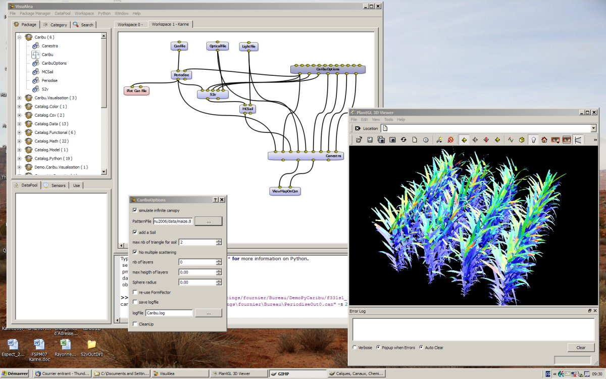

.. openalea documentation master file, created by sphinx-quickstart on Tue Dec  2 10:18:07 2008.
   You can adapt this file completely to your liking, but it should at least
   contain the root `toctree` directive.

#################################
Welcome to OpenAlea documentation
#################################

.. module:: main

:Version: |version| 
:Date: |today|

.. note:: This documentation can be downloaded as a `PDF <../latex/Openalea.pdf>`_

|text1|  

|text2|

OpenAlea_ documentation
======================= 

+---------------------------+---------------------------+--------------------+
|         OPENALEA          |        VPLANTS            |      CARIBU        |
| |openalea|                | |vplants|                 |    |caribu|        |
|.. toctree::               |             |vplants_toc| | |caribu_toc|       |
|    :maxdepth: 1           |                           |                    |
|                           |                           |                    |
|    rst_tutorial           |                           |                    |
|                           |                           |                    |
+---------------------------+---------------------------+--------------------+

.. |vplants| image:: images/vplants.png
    :target: http://www-sop.inria.fr/virtualplants/wiki/doku.php
    :width: 100%
    :height: 200px
    :alt: project vplants

.. |openalea| image:: images/openalea.png
    :target: http://openalea.gforge.inria.fr/dokuwiki/doku.php
    :width: 100%
    :height: 200px

:mod:`actor`

.. toctree::
    :maxdepth: 1

..    core/reference_index
    stdlib/reference_index
    sconsx/reference_index
    deploy/reference_index
    deploygui/reference_index
    misc/reference_index
    visualea/reference_index

..    stdlib/reference_index
    sconsx/reference_index

About this documentation
========================    
.. toctree::
    :maxdepth: 1    
        
    tutorial/rst_tutorial
    tutorial/sphinx_tutorial
    Example, how to fill your docstrings<tutorial/template>
    How to create template to your package documenation<tutorial/create_template>

  

.. _OpenAlea: http://openalea.gforge.inria.fr
.. _visualea: ../visualea.html

.. |longtext| replace:: this is a longish text to include within a table and 
    which is longer than the width of the column.
    
.. |image1| image:: images/openalea_general.png
   :height: 250pt
   :width: 100%
   :scale: 100
   :alt: alternate text

.. Screenshot of :ref:`visualea<visualea>`, the GUI interface of Openalea_
    
    
.. |text1| replace:: OpenAlea_ is an open source project primarily aimed at
    the plant research community, with a particular focus on Plant 
    Architecture Modeling at different scales. It is a distributed 
    collaborative effort to develop Python libraries and tools which
    address the needs of current and future work in Plant Architecture
    modeling. OpenAlea includes modules to represent, analyse, and
    model the functioning and growth of plant architecture.
    
.. |text2| replace:: OpenAlea_ is developed concurrently on both 
   Windows and Linux. The source code is available under a free and libre 
   license. If you are interested in OpenAlea and would like to help it 
   grow, please join in the process. 
