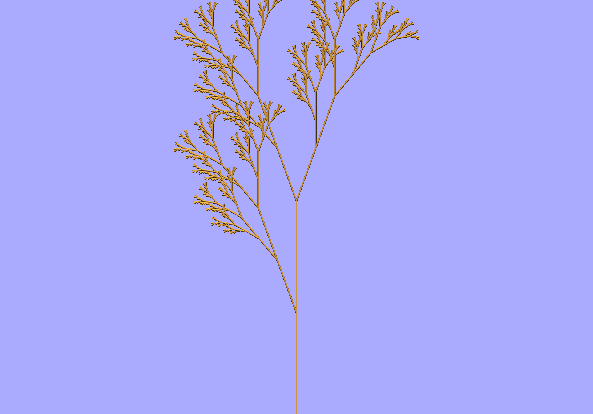

.. contents::

.. testsetup::

    import openalea.lpy as lpy
    from openalea.lpy import AxialTree
    from PyQt4.QtCore import *
    from PyQt4.QtGui import *
    import time
    from openalea.plantgl.all import *
    from openalea.mtg.io import lpy2mtg, mtg2lpy, axialtree2mtg, mtg2axialtree
    from openalea.mtg.aml import *
    app = QApplication([])
    Viewer.start()

Lsystem and MTG
###############

Let us start from the following L-system

.. literalinclude:: example.lpy

General usage
===============

First, import some modules

.. code-block:: python

    import openalea.lpy as lpy
    from openalea.lpy import AxialTree
    from PyQt4.QtCore import *
    from PyQt4.QtGui import *
    import time
    from openalea.plantgl.all import *
    from openalea.mtg.io import lpy2mtg, mtg2lpy, axialtree2mtg, mtg2axialtree
    from openalea.mtg.aml import *

and then, read the lsystem:

.. doctest::

    >>> l = lpy.Lsystem('source/tutorials/example.lpy')

execute it:

.. doctest::

    >>> tree = l.iterate() #doctest: +ELLIPSIS
    F[+X]F[-X]+X...

and plot the results:

.. doctest::

    >>> l.plot(tree)

that you can save into a PNG file as follows:

.. doctest::

    >>> Viewer.frameGL.saveImage('output.png', 'png')

Extract information from the lsystem
=====================================

axiom
-----

Get the axiom into an axialtree object:

.. doctest::

    l.axiom

context
-------

context gets the production rules, group, iteration number

.. doctest::

    >>> context = l.context()
    >>> context.getGroup()
    0
    >>> context.getIterationNb()
    6

last iteration
---------------

If the Lsystem finished nornally, the last iteration must be equal to the derivation length. 

.. doctest::

    >>> l.getLastIterationNb()
    6
    >>> l.derivationLength
    7

Activate the lsystem with makecurrent
=====================================
.. todo:: what is this for ?

::

    l.makeCurrent()

Executing the lsystem
=====================
animate
-------

In order to run the lsystem step by step with a plot refreshing at each step, use animate(), for which you may provide a minimal time step between each iteration.

::

    l.animate(step)

where step is in seconds. Note that you may still set the animation to false using::

    Viewer.animation(False)

iterate
-------

Run all steps until the end::

    >>> l.iterate() 
    
or step by step:

.. doctest::

    >>> l.iterate(1)
    F[+X]F[-X]+X
    AxialTree(F[+X]F[-X]+X)
    >>> tree = l.iterate(1)
    F[+X]F[-X]+X
    >>> l.iterate(1, 1, tree) == l.iterate(2)
    FF[+F[+X]F[-X]+X]FF[-F[+X]F[-X]+X]+F[+X]F[-X]+X
    F[+X]F[-X]+X
    FF[+F[+X]F[-X]+X]FF[-F[+X]F[-X]+X]+F[+X]F[-X]+X
    True

.. note:: When using `iterate()` with 1 argument, the Lsystem is run from the beginning again. To keep track of a previous run, 3 arguments are required. In such case, the first is used only to keep track of the number of iteration, that is stored in l.getLastIterationNb(), the second argument is then the number of iteration required and the 3d argument is the axiom (i.e., the previous AxialTree output).

Transform the lstring/axialtree into MTG and vice-versa
=======================================================

::

    >>> axialtree = l.iterate()

lpy2mtg method
--------------

axialtree2mtg method
---------------------

.. doctest::

    >>> axialtree = l.iterate() #doctest: +ELLIPSIS
    F[+X]F[-X]+X...
    >>> scales = {'F':1,'X':1}
    >>> mtg1 = axialtree2mtg(axialtree, scales, l.sceneInterpretation(axialtree), None)

and come back to the original one::

    >>> tree1 = mtg2axialtree(mtg1, scales, None, axialtree)
    >>> assert str(axialtree)==str(tree1)
    True

mtg2lpy and lpy2mtg method
--------------------------

::

    >>> mtg2 = lpy2mtg(axialtree, l)
    >>> tree2 = lpy2mtg(mtg2, l, axialtree)
    >>> assert str(axialtree)==str(tree2)
    True

    >>> scene = l.sceneInterpretation(axialtree)

if no lsystem is availabe, you may use generateScene(axialtree) using from openalea.lpy import generateScene

