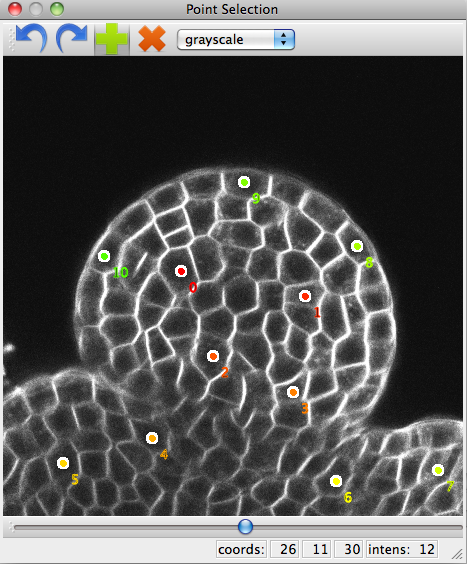

.. _qt_enabled_shell:

Graphical Tools
###############

.. warning ::

    If you use these classes from the Python command line make sure you have
    created a QApplication or else they will crash your shell.

    You can either use IPython_:

    .. code-block:: bash

        user@computer$ ipython gui=qt # or -q4thread on pre- 0.11 versions of IPython.

    or you can manually start a QApplication. In the python command line::

        from PyQt4 import QtGui
	app = QtGui.QApplication([])

Displaying images
=================
:class:`openalea.image.gui.display` can be used for displaying a matrix as an image.

.. code-block:: python
    :linenos:

    from openalea.image.all import display
    from PyQt4 import QtGui
    app = QtGui.QApplication([])
    w1 = display(im)

In VisuAlea, the same function exits in the package :class:`openalea.image.gui`. Let us drag and drop the node :class:`~openalea.display` in the workspace.

.. dataflow:: openalea.image.demo display

.. _point_selection_tool:

Point Selection Tool
====================

:func:`openalea.image.gui.point_selection.point_selection` is a graphical tool that letse you place points in an image.
It works for 2D and for 3D (by navigating through the slices).

.. code-block:: python
    :linenos:

    from openalea.image.all import point_selection
    from PyQt4 import QtGui
    app = QtGui.QApplication([])

    ps1 = point_selection(im1)

.. dataflow:: openalea.image.demo point_selection

Loading and saving points
'''''''''''''''''''''''''

It is possible to load points from a text file and use them. The text file must look like this:

.. code-block:: none

    142.3 124.4 398.1
    124.2 423.5 642.4
    234.0 540.1 543.2
    [...]

.. note:: If the image is 2D, leave out the third column.

Then load the file like this::

    import numpy as np
    pts1 = np.loadtxt("pts1.txt")
    ps1.set_points(pts1)

The points from the PointSelection widget can be obtained with :func:`~openalea.gui.point_selection.PointSelection.get_points`::

    pts1_bis = ps1.get_points()

They can then be saved .txt file with :func:`numpy.savetxt`::

    np.savetxt("pts1_bis.txt", pts1_bis)

