.. _numpy_user:

OpenAlea.Numpy User Guide
##########################

.. contents::

Introduction
============

This package is a pure VisuAlea package that provides a graphical interface to `Numpy <http://numpy.scipy.org/>`_ , which provides powerful numerical arrays objects, and routines to manipulate them.

The examples below are extract from `Tentative NumPy Tutorial <http://www.scipy.org/Tentative_NumPy_Tutorial#head-b85d2eebcc3e17026ecf98d2de83889f4dd5d8d8>`_.

Prerequisites 
=============

Before reading this tutorial you should know a bit of `VisuAlea <http://openalea.gforge.inria.fr/dokuwiki/doku.php>`_. If you would like to refresh your memory, take a look at the `VisuAlea tutorials <http://openalea.gforge.inria.fr/dokuwiki/doku.php?id=documentation:tutorials:beginners>`_.

You also need to have some software installed on your computer. As a bare minimum you would need `OpenAlea packages <http://openalea.gforge.inria.fr/dokuwiki/doku.php?id=download>`_.

An basic example
================

We define the following array:

.. code-block:: python

    >>> import numpy
    >>> a = numpy.arange(10).reshape(2,5)
    >>> a
    array([[0, 1, 2, 3, 4],
           [5, 6, 7, 8, 9]])

In VisuAlea, you first need to use the :class:`~openalea.numpy_wralea.creation.basics.py.arange` node. Let us drag and drop this node in the workspace (see :ref:`Fig 1 <Fig_1>`).

By default, the connectors `start`, `stop` and `step` of :class:`arange` are equal to 0, so set the connector `stop` to **10** as shown in :ref:`Fig 1 <Fig_1>`.

Then, you need to gives a new shape to the array without changing its data. For that, you can select the :class:`~openalea.numpy_wralea.manipulation.basics.py.reshape` node and set the connector `newshape` to **(2,5)**. 

Now, it is time to run the dataflow. Press Ctrl+R or right click on the :class:`reshape` node and select `run`.

.. _Fig_1:
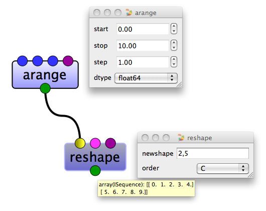

   **Figure 1: Simple creation of an array in VisuAlea**

We have just created an array object. The array a has several attributes --or properties : 

.. code-block:: python
    >>> a.shape
    (2, 5)
    >>> a.ndim 
    2
    >>> a.size
    10
    >>> a.dtype
    'float64'    
    >>> a.itemsize
    8

In VisuAlea, you can use the following nodes to get these properties as shown in :ref:`Fig 2 <Fig_2>`.

.. _Fig_2:
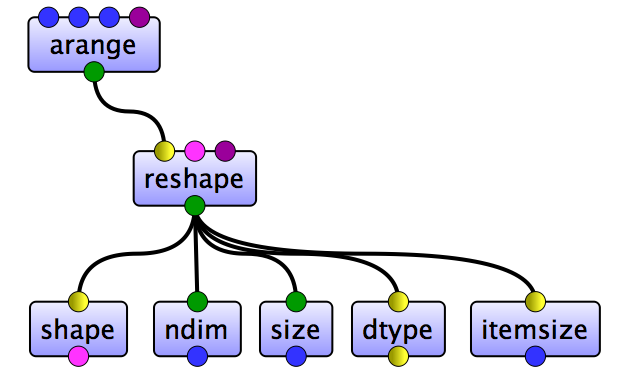

   **Figure 2: Properties of an array in VisuAlea**

Array Creation
==============

There are many ways to create arrays. For example, you can create an array from a regular Python list or tuple using the array function.

.. code-block:: python

    >>> a = array( [2,3,4] )
    >>> a
    array([2, 3, 4])

In VisuAlea, you can create an array from a regular Python list or tuple using the array node as follow :

.. _Fig_3:
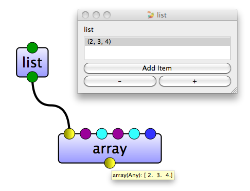

   **Figure 3: Array creation in VisuAlea**

:class:`~openalea.numpy_wralea.creation.basics.py.array` node transforms sequences of sequences into two dimensional arrays, and it transforms sequences of sequences of sequences into three dimensional arrays, and so on. 

.. _Fig_4:
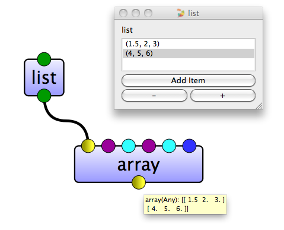

   **Figure 4: Creation of two dimensional array in VisuAlea**

Once we have an array we can take a look at its attributes: 

.. _Fig_5:
.. figure:: images/properties2.png

   **Figure 5: Properties of two dimensional array in VisuAlea**

The type of the array can also be explicitly specified at creation time: 

.. _Fig_6:
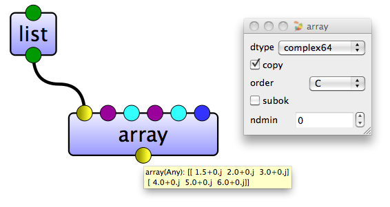

   **Figure 6: Type of the array in VisuAlea**

The function array is not the only one that creates arrays. Usually the elements of the array are not known from the beginning, and a placeholder array is needed. There are some functions to create arrays with some initial content. By default, the type of the created array is float64.

The function zeros creates an array full of zeros, and the function ones creates an array full of ones. 

.. code-block:: python

    >>> zeros( (3,4) )                              # the parameter specifies the shape
    array([[0.,  0.,  0.,  0.],
           [0.,  0.,  0.,  0.],
           [0.,  0.,  0.,  0.]])
    >>> ones( (2,3,4), dtype=int16 )                # dtype can also be specified
    array([[[ 1, 1, 1, 1],
            [ 1, 1, 1, 1],
            [ 1, 1, 1, 1]],
           [[ 1, 1, 1, 1],
            [ 1, 1, 1, 1],
            [ 1, 1, 1, 1]]], dtype=int16)

In VisuAlea, the following functions are implemented as shown in :ref:`Fig 7 <Fig_7>`.

.. _Fig_7:
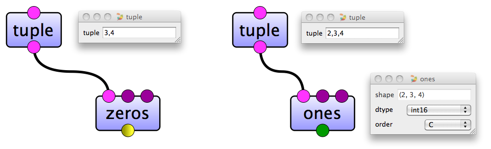

   **Figure 7: Creation of a zeros array and a ones array in VisuAlea**

The function empty creates an array without filling it in. Then the initial content is random and it depends on the state of the memory. 

.. _Fig_8:
.. figure:: images/empty.png

   **Figure 8: Empty array in VisuAlea**

To create sequences of numbers, VisuAlea provides the function :class:`~numpy.arange` which is analogous to range that returns arrays instead of lists :

.. _Fig_9:
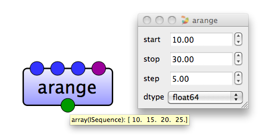

   **Figure 9: Arange array in VisuAlea**

Using arange with floating point arguments, it is generally not possible to predict the number of elements obtained (because of the floating point precision). 
For this reason, it is usually better to use the function linspace that receives as an argument the number of elements that we want, instead of the step: 

.. _Fig_10:
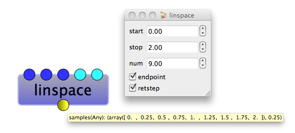

   **Figure 10: Linspace array in VisuAlea**

.. todo:: Check the list and verify the behavior

See nodes available within VisuAlea in `numpy.creation <numpy_creation.html>`_ package.

Basic Operations
================

Arithmetic operators on arrays apply elementwise. A new array is created and filled with the result. 

.. _Fig_11:
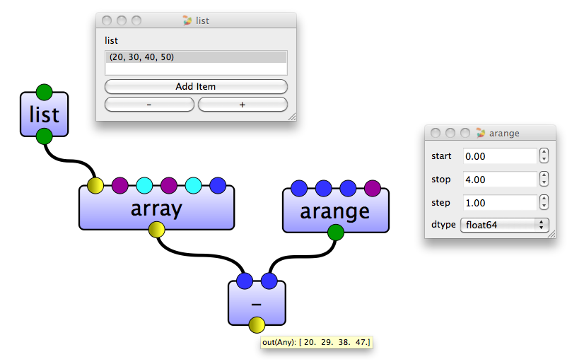

   **Figure 11: Subtraction of two arrays in VisuAlea**

.. _Fig_12:
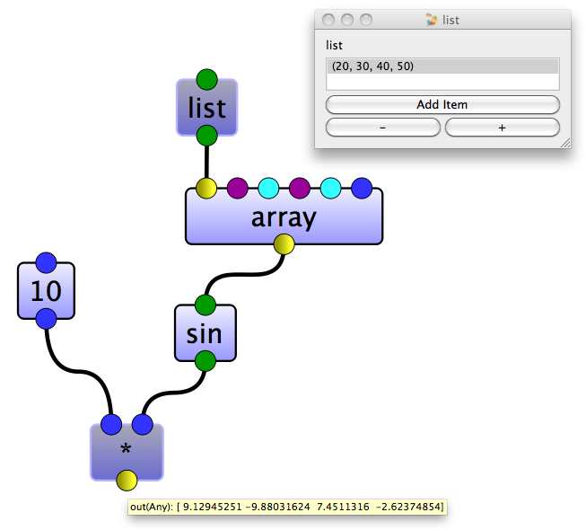

   **Figure 12: Multiplication using a integer and the sinus of an array in VisuAlea**

.. _Fig_13:
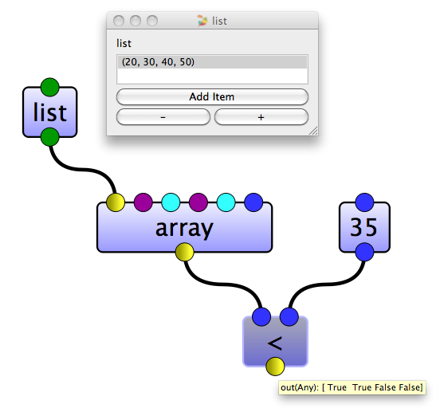

   **Figure 12: Check if the values of an array is less than the value 35 in VisuAlea**

Unlike in many matrix languages, the product operator * operates elementwise in NumPy arrays. The matrix product can be performed using the :class:`~numpy.dot` node :

.. _Fig_13:
.. figure:: images/dot.png

   **Figure 13: Matrix product in VisuAlea**

Many unary operations, like computing the sum of all the elements in the array, are implemented as nodes in VisuAlea :

.. _Fig_14:
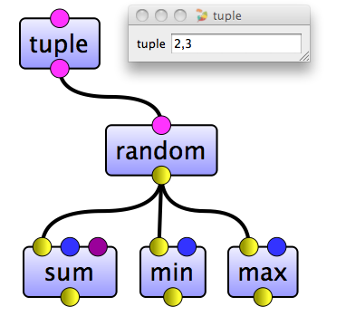

   **Figure 14: Unary operations in VisuAlea**

By default, these operations apply to the array as if it were a list of numbers, regardless of its shape. However, by specifying the connector axis you can apply an operation along the specified axis of an array: 

.. _Fig_15:
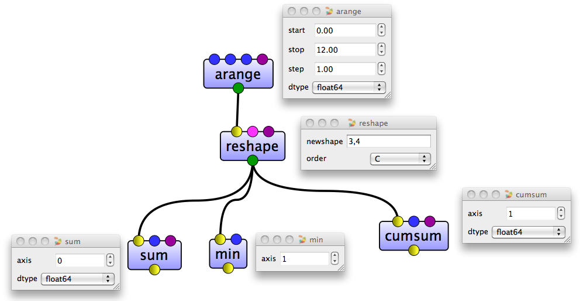

   **Figure 15: Using of the connector axis in VisuAlea**

.. todo:: Check the list and verify the behavior

**The following nodes are available within VisuAlea in numpy.math package**

    all,  alltrue,  any,  apply along axis,  argmax,  argmin,  argsort,  average,  bincount,  ceil,  clip,  conj,  conjugate,  corrcoef,  cov,  cross,  cumprod,  cumsum,  diff,  dot,  floor, inner, inv, lexsort, max, maximum, mean, median, min, minimum, nonzero, outer, prod, re, round, sometrue, sort, std, sum, trace, transpose, var, vdot, vectorize, where

Indexing, Slicing and Iterating
===============================

One dimensional arrays can be indexed, sliced and iterated over pretty much like lists and other Python sequences. 

.. code-block:: python

    >>> a = arange(10)**3
    >>> a
    array([  0,   1,   8,  27,  64, 125, 216, 343, 512, 729])
    >>> a[2]
    8

In VisuAlea, you need to use the nodes `slice` and `getitem` as follow :

.. _Fig_16:
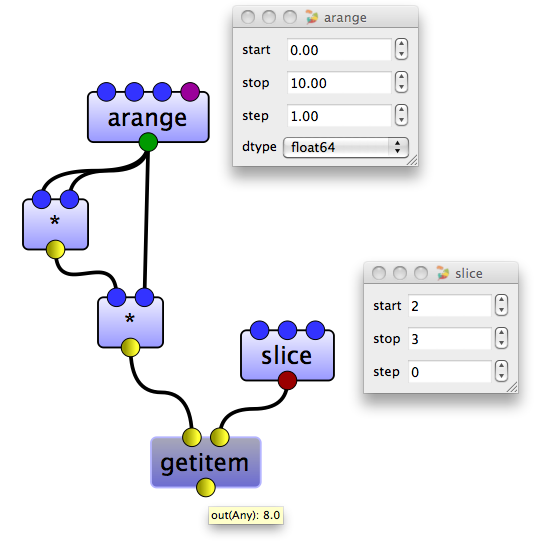

   **Figure 16: Basic slicing in VisuAlea**

As the same way, the following example :

.. code-block:: python

    >>> a = arange(10)**3
    >>> a
    array([  0,   1,   8,  27,  64, 125, 216, 343, 512, 729])
    >>> a[2:5]
    array([ 8, 27, 64])

can be done in VisuAlea :

.. _Fig_17:
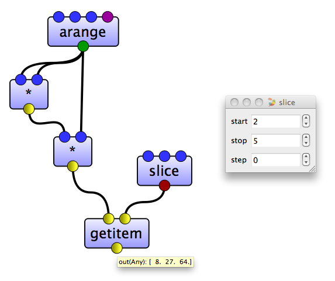

   **Figure 17: Basic slicing in VisuAlea**

Reversed an array :

.. _Fig_18:
.. figure:: images/reverse.png

   **Figure 18: Reverse an array in VisuAlea**

.. todo:: Modify elements in an array

Slicing multidimensional arrays : 

.. _Fig_19:
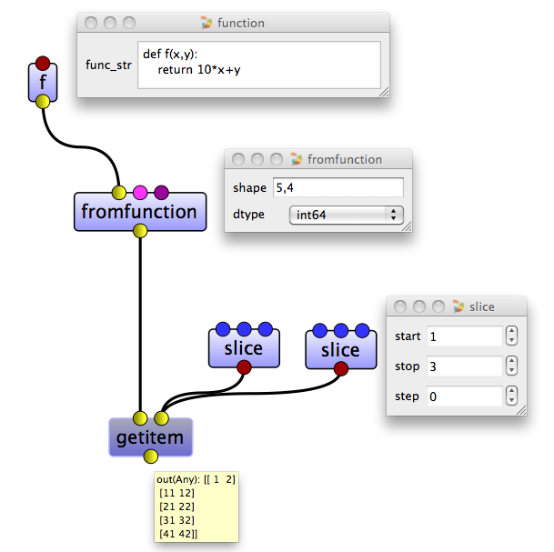

   **Figure 19: Slicing multidimensional arrays in VisuAlea**

Iterating over multidimensional arrays is done with respect to the first axis: 

.. todo:: add dataflow

.. todo:: Check the list and verify the behavior

**The following nodes are available within VisuAlea in numpy. package**

    newaxis, ndenumerate, indices, index exp

Shape Manipulation
==================

Changing the shape of an array
------------------------------

An array has a shape, given by the number of elements along each axis. The shape of an array can be changed with various nodes : 

.. _Fig_20:
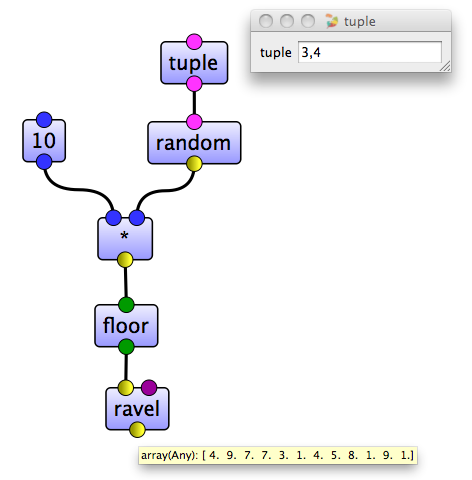

   **Figure 20: Changing the shape of an array in VisuAlea**

Stacking together different arrays
----------------------------------

Several arrays can be stacked together, along different axes: 

.. _Fig_21:
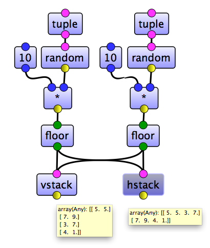

   **Figure 21: Stacking together different arrays in VisuAlea**

See nodes available within VisuAlea in `numpy.manipulation <numpy_manipulation.html>`_ package.

Less Basic
==========

Universal Functions
-------------------

NumPy provides mathematical functions, called "universal functions"(ufunc), that operate on the ndarray object. 
In VisuAlea, these functions are available in `numpy.ufunc <numpy_ufunc.html>` package :

.. _Fig_22:
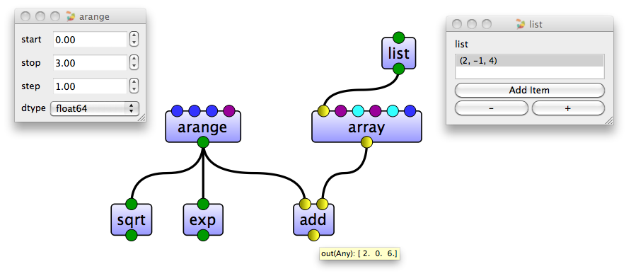

   **Figure 22: Universal Functions in VisuAlea**

