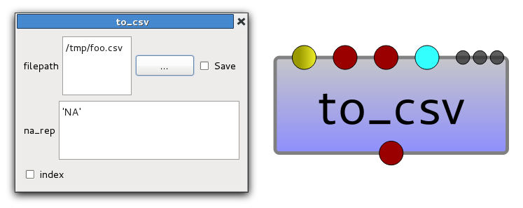
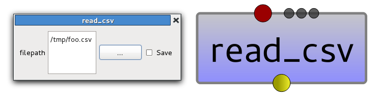

.. _pandas_user:

OpenAlea.Pandas User Guide
##########################

This user guide explains how to use the VisuAlea nodes implemented 
in :ref:`OpenAlea.Pandas <pandas>`. 

.. contents::

Introduction
============

:ref:`OpenAlea.Pandas <pandas>` is a pure VisuAlea package that provides a graphical 
interface to `Pandas <http://pandas.pydata.org/>`_. `Pandas <http://pandas.pydata.org/>`_ 
is an open source, BSD-licensed library providing high-performance, easy-to-use 
data structures and data analysis tools for the Python programming language.

:ref:`OpenAlea.Pandas <pandas>` does not interface all the structures and tools 
provided by `Pandas <http://pandas.pydata.org/>`_. For a list of the 
`Pandas <http://pandas.pydata.org/>`_ structures and tools interfaced by 
:ref:`OpenAlea.Pandas <pandas>`, see :ref:`pandas_nodes`.

All the data files used in :ref:`pandas_user` are available in the 'test/data' 
directory of the source distribution. 

Getting Data In/Out
===================

CSV
---

Writing to a csv file
^^^^^^^^^^^^^^^^^^^^^^

You can write a :class:`pandas.DataFrame` object :obj:`df` to a CSV file 'foo.csv'
using the :meth:`pandas.DataFrame.to_csv` method.

First create the :obj:`df`::

    In [1]: import pandas
    
    In [2]: import numpy as np
    
    In [3]: df = pandas.DataFrame(np.random.randn(8, 3), columns=['A', 'B', 'C'])
    
Then write :obj:`df` to 'foo.csv'::
    
    In [4]: df.to_csv('foo.csv', na_rep='NA', index=False)
    
In VisuAlea, the :meth:`pandas.DataFrame.to_csv` method is wrapped in the 
**openalea.pandas.io.to_csv** node:

   **Figure 1: Writing to a CSV file**

Using **openalea.pandas.io.to_csv**, the missing data are represented by 'NA', and 
the row names (i.e. index) are not written.

Reading from a csv file
^^^^^^^^^^^^^^^^^^^^^^^^

You can read a CSV file :download:`foo.csv <../../test/data/foo.csv>` and create 
a :class:`pandas.DataFrame` object :obj:`df` with the :func:`pandas.read_csv` function::

    In [5]: df = pandas.read_csv('foo.csv')
    
    In [6]: df
    Out[6]:
              A         B         C
    0 -0.091487  0.309001  0.216846
    1 -1.343021  0.578305 -1.373980
    2  0.509500 -0.369703 -1.468694
    3 -0.692185  0.551798 -1.161958
    4  0.374643  0.188016 -1.540916
    5 -0.783454  0.069107 -0.202349
    6  0.657052 -1.167102 -0.584808
    7 -0.639037  1.144806  0.547144

In VisuAlea, the :func:`pandas.read_csv` function is wrapped in the 
**openalea.pandas.io.read_csv** node:

   **Figure 2: Reading from a CSV file**

