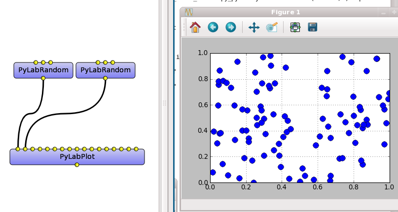
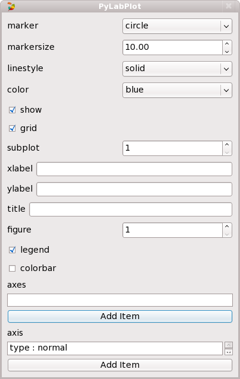
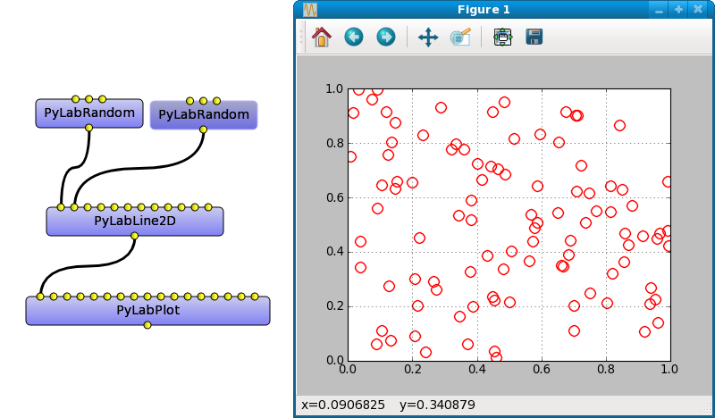
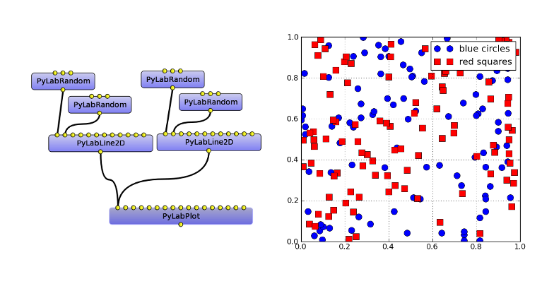
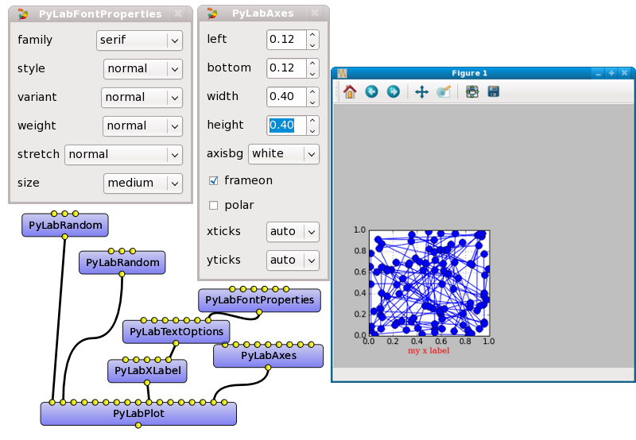
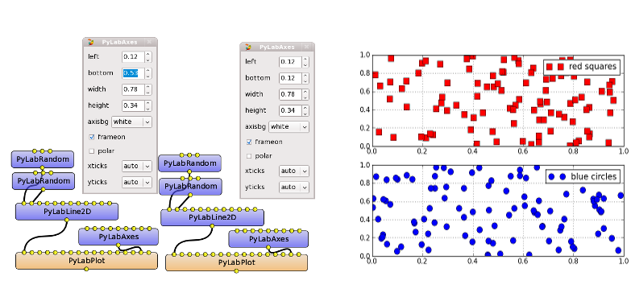
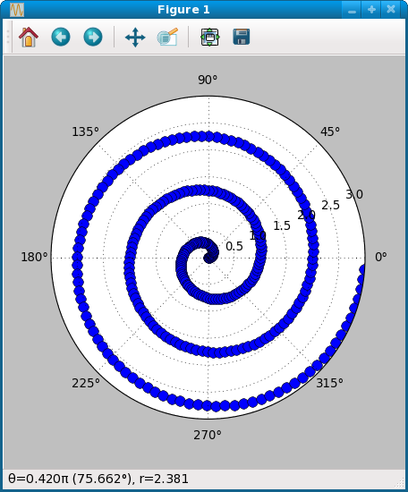

.. _pylab_user:

OpenAlea.Pylab User Guide
##########################

.. contents::

Introduction
============

This package is a pure VisuAlea package that provides a graphical interface to `Matplotlib <http://matplotlib.sourceforge.net/index.html>`_ , which is a python package for 2D and 3D plottings. When combined with Numpy and Scipy packages, Matplotlib becomes a great tool for analysing and visualing scientific data. Due to the versatile capabilities of Matplotlib with many options and arguments, it may sometimes be quite cumbersome to know what are the possible tunable and customisable arguments -- despite the great documentation that the authors put online. This drawback motivated us in developing a visual interface of Matplotlib within VisuAlea.

.. note:: this package is called *openalea.pylab* instead of *openalea.matplotlib* so as to be as close as possible to the python commands that you would use in a Python environment. Indeed, if you were to use the plot command of matplotlib, you would type

:: 

    from pylab import plot, show
    plot(x,y)
    show()

Here below, you will find a tutorial that allows you to start with the `OpenAlea.Pylab`

.. warning:: because OpenAlea.Pylab is a pure VisuAlea package, you cannot import it within Python using *import openalea.pylab*. Yet, you may access to the class defined inside the __wralea__ files using e.g., *import openalea.pylab_nodes_text_wralea.py_pylab*. See the reference guide for the available filenames.

Tutorials
=========

This tutorial presents some of the nodes implemented in the **openalea.pylab** package, which provides an interface to pylab functionalities within VisuAlea.

We do not present all the nodes but only the most relevant ones so as to describe the logic that has been used.

All public nodes can be found within VisuAlea in the Package Manager by browsing the OpenAlea directory, look for pylab sub directory

2D Plotting
-----------

First example
~~~~~~~~~~~~~
Let us start with a simple 2D plot that would be done as follows in pylab:

.. code-block:: python
    :linenos:

    from pylab import random
    from pylab import plot, show
    x = random(100)
    y = random(100)
    plot(x,y)
    show()

In VisuAlea, you first need to create the random data using the :class:`~openalea.pylab_nodes_wralea.py_pylab.PyLabRandom` node (equivalent to line 3,4). Let us drag and drop two of those nodes in the workspace (see :ref:`Fig 1 <Fig_1>`) . Then, you need to select :class:`~openalea.pylab_nodes_wralea.py_pylab.PyLabPlot`. This node has many connectors and so will have all plotting nodes. We will explain why in a moment. For now, just keep in mind that the connectors roughly follows the same options as the original pylab.plot function. For instance, if you look at the documentation of pylab.plot you will get someting like::

    Plot lines and/or markers to the
    :class:`~matplotlib.axes.Axes`.  *args* is a variable length
    argument, allowing for multiple *x*, *y* pairs with an
    optional format string.  For example, each of the following is
    legal::

        plot(x, y)         # plot x and y using default line style and color
        plot(x, y, 'bo')   # plot x and y using blue circle markers
        plot(y)            # plot y using x as index array 0..N-1
        plot(y, 'r+')      # ditto, but with red plusses

Well, in VisuAlea the first connector of :class:`PyLabPlot` node is `x` and the second connector is `y`. As simple as that. So, connect the random nodes to the first and second connector of the Plot node (equivalent to line 5).

.. warning:: the `x` and `y` objects must have the same length.
.. warning:: if after connecting the `x` and `y` objects you decided to remove the `y` object, you will have to *reload* the *plot* node to reset the `y` data.

Now, it is time to run the dataflow. Press Ctrl+R or right click on the :class:`PyLabPlot` node and select `run` (equivalent to line 6).

By default, the marker are blue circles as shown in :ref:`Fig 1 <Fig_1>`, and the linestyle is solid. To remove the lines between each point double click on the Plot node and select nothing in place of solid. Similarly if you want to change the color or marker.

.. _Fig_1:

   **Figure 1: simple xy-plot in VisuAlea**

Now the first questions arise:

    1. What kind of options do I have ? What shall I do if I want to increase the size of the marker(see next section) 
    2. What about xlabel and title ? (see :ref:`Enhance the layout <sectext>` section)
    3. What if I have multiple xy data, or if I have several y-data that shares the same x-data ? Is it possible to get something equivalent to the pylab command  `plot(x, y1, x, y2)` ?  (see :ref:`multiple data set section <secmultiple>`).

Playing with the options/connectors
~~~~~~~~~~~~~~~~~~~~~~~~~~~~~~~~~~~

============= ==============
============= ==============
|longtext|    |image1|
============= ==============

.. |longtext| replace:: If you right-click on the :class:`~openalea.pylab_nodes_wralea.py_pylab.PyLabPlot` node a pop-up window appears letting you introspect the connectors. In the case of the PyLabPlot node used in :ref:`Fig 1<Fig_1>`, the following window pops up. 
   **The first options** (marker, markersize, linestyle and color) **are specific to** :class:`~openalea.pylab_nodes_wralea.py_pylab.PyLabPlot`. **The following options** (show, grid, subplot, xlabel, ylabel, title, figure, legend, colorbar, axes and axies) are common to all the plotting nodes and **are NOT options of the plot itself**. Let us call them **functional options**. Most of the functional options can be customised with specialised nodes from the *text nodes* sub package (a sub directory in the package manager), which API is available in the :mod:`~openalea.pylab_text_wralea.py_pylab` module. The connection of specialised nodes will be explained further in the :ref:`sec_text` section.

So, in the poped up window, we can select a different marker with a different color (e.g., square, red). Now, again the question is what if we want to change the transparency of the marker (the `alpha` option in pylab terminology). Well this is not possible as it is... since it is not part of the connectors. Because it is not reasonable to set too many connectors/options, we created a specialised node inspired from pylab class :class:`pylab.Line2D`, which is called :class:`~openalea.pylab_nodes_wralea.py_pylab.PyLabLine2D`. It allows to convert the x and y input data sets into a matplotlib data structure that can be fully customised. It works as illustrated in :ref:`Fig 2<Fig_2>`

.. _Fig_2:

    **Figure 2: In order to fully customised the style of the xy data, you should use a data convertor called PyLabLine2D as illustrated in the figure.**

Now you can right-clicked on this node to access much more options to customise the data sets.

.. _secmultiple:
multiple data set
~~~~~~~~~~~~~~~~~

In order to plot several datasets, the best method is to use the convertor :class:`~openalea.pylab_nodes_wralea.py_pylab.PyLabLine2D` as many times as needed. Indeed, this method allows to customise each data set independantly. 

.. warning:: all data converted with PyLabLine2D must be connected to the x connector.
.. note:: the `PyLabLine2D` node may have a x data set only; y is optional.

If you do not want to use the :class:`PyLabLine2D`, you can still connect several data sets directly to the :class:`PyLabPlot` nodes but customisation is not possible. If several x and y data sets are connected, then PyLabPlot will automatically select a color for each of them. Finally, you may connect a single data set to x, and several data sets to y connector. If so, x data set is supposed to be common to all y data sets.

.. _Fig_4:

    **Figure 3: adding several data sets on the same axes is possible and data sets are fully customisable using convertor such as PyLabLine2D**

Other examples scatter, hexbin, ...
~~~~~~~~~~~~~~~~~~~~~~~~~~~~~~~~~~~

There are many more plotting nodes such as :class:`~openalea.pylab_nodes_wralea.py_pylab.PyLabScatter` or :class:`~openalea.pylab_nodes_wralea.py_pylab.PyLabHexbin`. They all work on the same principle as those described previously in the case of :class:`~openalea.pylab_nodes_wralea.py_pylab.PyLabPlot`. The :ref:`Gallery section<secgallery>` shows examples.

.. _sectext:
Enhance the layout
------------------

As seen in the previous examples, there are many connectors in each Plotting nodes. We've also seen that there are two kind of connectors. On one hand (left side), you will find the connectors dedicated to the plotting node itself. Those that are in the docstring of the original pylab function. On the other hand (right side), you will find **functional connectors** such as figure, legend, xlabel... By default, you can indeed set the xlabel of the axes. However, if you want to further customise the xlabel, you will need to use the dedicated node (:class:`~openalea.pylab_text_wralea.py_pylab.PyLabXLabel`). 

There are many functional connectors that are described in :mod:`text nodes <openalea.pylab_text_wralea.py_pylab>`.

As an example, let us consider the case where you want to have an xlabel in red. In addition, you want to restrict the dimension of the Axes so that it correspond to a lower left axes in the figure. In pure pylab, you would write something like:

.. code-block:: python
    :linenos:

    from pylab import plot, show, xlabel, figure, axes, random
    figure(1)
    x = random(100)
    y = random(100)
    axes([0.15,0.15, 0.4, 0.4])
    plot(x,y)
    xlabel('my customised red label', color='red')
    show()

That would be coded in VisuAlea as follows by connecting a :class:`~openalea.pylab_text_wralea.py_pylab.PyLabAxes` and :class:`~openalea.pylab_text_wralea.py_pylab.PyLabXLabel` nodes to the corresponding functional connector: 

.. _Fig_3:

    **Figure 4: Example that illustrates how to connect functional connectors such as** :class:`~openalea.pylab_text_wralea.py_pylab.PyLabAxes` **to further customised the final figure and axes.**

Several plot with Axes
----------------------

.. _Fig_5:

    **Figure 5: Example that illustrates how to create subplot (several axes) on the same figure.**

Adding patches
--------------
.. todo:: in progress

Here, we look at a particular set of nodes that can be found in :mod:`patches <openalea.pylab_patches_wralea.py_pylab>`

Interest of the :class:`~openalea.pylab_text_wralea.py_pylab.PyLabShow` nodes
-----------------------------------------------------------------------------
.. todo:: in progress

3D plotting
-----------
.. todo:: in progress

.. _secgallery:
Gallery
=======

====================== =================== =====================
====================== =================== =====================
|gallery_polar_text|   |gallery_polar|     |gallery_polar_df|
====================== =================== =====================

.. |gallery_polar_text| replace:: To create a polar plot, first get some data (here) :math:`2\pi t` and change the axes to  polar using the :class:`PyLabAxes`

.. |gallery_polar_df| image:: gallery_polar_df.png
   :width: 70%
