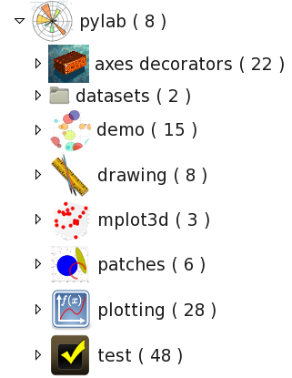

.. _pylab_user:

OpenAlea.Pylab User Guide
##########################

.. contents::

Introduction and Motivation
===========================

This package is a pure VisuAlea package that provides a graphical interface to `Matplotlib <http://matplotlib.sourceforge.net/index.html>`_, which is a python package for 2D and 3D plottings. When combined with Numpy and Scipy packages, Matplotlib becomes a great tool to analyse and visualize scientific data. Due to the versatile capabilities of Matplotlib with many options and arguments, it may sometimes be quite cumbersome to know what are the arguments of each function -- despite the great documentation that authors put online. This difficulty motivated us in developing a visual interface of Matplotlib within VisuAlea.

.. note:: this package is called *openalea.pylab* instead of *openalea.matplotlib* so as to be as close as possible to the python commands that you would use in a Python environment. Indeed, if you were to use the plot command of matplotlib, you would type

:: 

    from pylab import plot, show
    plot(x,y)
    show()

.. warning:: This documentation is not a documentation about Matplotlib usage. Neverthelees, concepts, options, function names used
    within the VisuAlea nodes are very similar to the original version. Therefore, usage should be straightforward to people that 
    are already familiar with Matplotlib.

Overview
=========

.. note:: In pylab terminology, a **figure** is a window, where several **axes** 
    can be plotted.

All public nodes can be found within VisuAlea in the Package Manager by browsing into the
OpenAlea.PyLab directory.

The openalea.pylab contains several sub directories:

    * **axes decorators** that are used to add labels, title into an axes, or to tune the axes itself
    * **datasets** that could be useful to play with in demos and tests
    * **demo** that illustrates the usage of the VisuAlea nodes
    * **drawing** provides further nodes to add annotations to an axes
    * **mplot3d** is related to mplot3d (3d plotting nodes)
    * **patches** is related to pylab.patches (patches that can be add to an axe such as Ellipse, Circle)
    * **plotting** contains all pylab plotting function.
    * **test** tests of all nodes.

First example
-------------
Let us start with a simple 2D plot that would be done as follows in pylab:

.. code-block:: python
    :linenos:

    from pylab import random
    from pylab import plot, show
    x = random(100)
    y = random(100)
    plot(x,y)
    show()

In VisuAlea, you first need to create the random data using the :class:`~openalea.numpy.randn` node (equivalent to line 3,4). Let us drag and drop two of those nodes in the workspace. Then, you need to select :class:`~openalea.pylab_plotting_wralea.py_pylab.PyLabPlot`. This node has many connectors but just keep in mind that the connectors roughly follows the same options as the original pylab.plot function. 

Note also that, in VisuAlea, the first connector is reserved for the axes. So, you need to connect the x data to the second connector and the *y* data to the third connector.

.. warning:: the `x` and `y` objects must have the same length.
.. warning:: if after connecting the `x` and `y` objects you decided to remove the `y` object, you will have to *reload* the *plot* node to reset the `y` data.

.. dataflow:: openalea.pylab.test tutorial_plot
    :width: 40%

    **Figure 1: Simplest** PyLabPlot_ **usage.** Connect any valid arrays to the x and y connectors (x and y must have the same length)

Now, it is time to run the dataflow. Press Ctrl+R or right click on the PyLabPlot_ node and select `run` (equivalent to line 6).

.. plot::
    :width: 40%

    from openalea.core.alea import *
    pm = PackageManager()
    run_and_display(('openalea.pylab.test', 'tutorial_plot'),{},pm=pm)

Now the first questions arise:

    1. What kind of options do I have ? What shall I do if I want to increase the size of the marker(see next section) 
    2. What about xlabel and title ? (see :ref:`Enhance the layout <sectext>` section)
    3. What if I have multiple xy data, or if I have several y-data that shares the same x-data ? Is it possible to get something equivalent to the pylab command  `plot(x, y1, x, y2)` ?  (see :ref:`multiple data set section <secmultiple>`).

Playing with the options/connectors
-------------------------------------

.. figure:: connectors.png
    :width: 180pt
    :height: 250pt
    :align: center

    If you right-click on the PyLabPlot_ node then a pop-up window appears (figure above).   **The first options** (marker, markersize, linestyle and color) **are specific to** PyLabPlot_. The *figure*  options is common to all the plotting nodes. To further customize this node, you need to know the pylab options and add then in the kwargs section as key/value pairs. Another way is to convert the x/y data into a specialised object with PyLabLine2D_ as explained later on.

So, in the pop-up window, we can select a different marker with a different color (e.g., square, red). Now, again the question is what if we want to change the transparency of the marker (the `alpha` option in pylab terminology). Well this is not possible as it is... since it is not part of the connectors. Because it is not reasonable to set too many connectors/options, we created a specialised node inspired from pylab class :class:`pylab.Line2D`, which is called PyLabLine2D_. It allows to convert the x and y input data sets into a matplotlib data structure that can be fully customised. It works as follows:

.. dataflow:: openalea.pylab.test tutorial_plot_line2d
    :width: 40%

    **Figure 2: Customize plot with** PyLabLine2D_ **node.** In order to fully customised 
    the style of the xy data, you should use a data convertor called PyLabLine2D_ as illustrated in the figure.

.. plot::
    :width: 40%

    from openalea.core.alea import *
    pm = PackageManager()
    run_and_display(('openalea.pylab.test', 'tutorial_plot_line2d'),{},pm=pm)

.. _secmultiple:
multiple data set
-------------------------------------

In order to plot several datasets, the best method is to use the convertor PyLabLine2D_ 
as many times as needed. Indeed, this method allows to customise each data set independantly. 

This is also the simplest method to add specific label to a curve, which becomes handy when 
legend is required.

.. code-block:: python
    :linenos:

    from pylab import random
    from pylab import plot, show
    x1 = random(100)
    y1 = random(100)
    x2 = random(100)
    y2 = random(100)
    plot(x1,y1, 'ro', label='data1', x2, y2, 'bo', label='data2)
    legend()
    show()

.. warning:: all data converted with PyLabLine2D must be connected to the x connector only.
.. note:: the `PyLabLine2D` node may have a x data set only; y is optional.

If you do not want to use the PyLabLine2D_, you can still connect several data sets directly to the PyLabPlot_ nodes but customisation is not possible. If several x and y data sets are connected, then PyLabPlot will automatically select a color for each of them. Finally, you may connect a single data set to x, and several data sets to y connector. If so, x data set is supposed to be common to all y data sets.

.. dataflow:: openalea.pylab.test legend
    :width: 40%

    **Figure 3: adding several data sets on the same axes is possible and data sets are fully customisable using convertor such as** PyLabLine2D_

.. plot::
    :width: 40%

    from openalea.core.alea import *
    pm = PackageManager()
    run_and_display(('openalea.pylab.test', 'legend'),{},pm=pm)

Enhance the layout
------------------

In the previous section, we've seen in details the PyLabPlot_ node. There are many more nodes with 
the same kind of behaviour and usage, which are fully described in the reference guide. None of 
those functions allows you to customize the axes. To do so, you will need to use the 
:mod:`~openalea.pylab_decorators_wralea.py_pylab` module. 

This module provides nodes that allows you to add elements into an axe (e.g, labels, title, legend, grid), or to modify the axes
(e.g., axis, xlim, xticks). There are even more elements to be added such as patches (see mod:`~openalea.pylab.patches_wralea.py_pylab`).

As an example, let us consider the case where you want to have an xlabel in red color. In addition, you want to restrict the 
dimension of the Axes so that it corresponds to a lower left axes in the figure. In pure pylab, you would write something like:

.. code-block:: python
    :linenos:

    from pylab import plot, show, xlabel, figure, axes, random, legend
    figure(1)
    x = random(100)
    y = random(100)
    axes([0.15,0.15, 0.4, 0.7])
    plot(x,y,label='data1')
    xlabel('my customised red label', color='red', fontsize=18)
    legend()
    show()

That would be coded in VisuAlea as follows by connecting a :class:`~openalea.pylab_decorators_wralea.py_pylab.PyLabAxes` 
and :class:`~openalea.pylab_decorators_wralea.py_pylab.PyLabXLabel` nodes to the corresponding functional connector: 

.. dataflow:: openalea.pylab.test tutorial_labels
    :width: 40%

    **Figure 4: Connection of axes decorators** The :class:`~openalea.pylab_decorators_wralea.py_pylab.PyLabAxes` 
    allows us to change the width and height of axes while the XLabel adds a label on the xaxis that is colored
    in red thanks to a **PyLabTextProperties** nodes.

.. plot::
    :width: 40%

    from openalea.core.alea import *
    pm = PackageManager()
    run_and_display(('openalea.pylab.test', 'tutorial_labels'),{},pm=pm)

Some Examples
===============

Adding patches
--------------

With pylab, it is possible to add patches such as circle, ellipse, polygon, etc on top of a axe.
Some of those patches are available as visualea nodse. Look at the :mod:`patches <openalea.pylab_patches_wralea.py_pylab>` reference section to see how to use them. There is also a demo available called `patches`, which dataflow looks like:

.. dataflow:: openalea.pylab.demo patches
    :width: 50%

.. plot::

    from openalea.core.alea import *
    pm = PackageManager()
    run_and_display(('openalea.pylab.demo', 'patches'),{},pm=pm)

3D plotting
-----------
Some 3D plotting are also available. See :mod:`mplot3d <openalea.pylab_3d_wralea.py_pylab>` module in the reference. The following dataflow gives you a flavor of what it looks like.

.. dataflow:: openalea.pylab.test mcontourf3d
    :width: 50%
 
.. plot::

    from openalea.core.alea import *
    pm = PackageManager()
    run_and_display(('openalea.pylab.test', 'mcontourf3d'),{},pm=pm)

.. _sec_example:

2D plotting
-------------

Many more nodes ara available. Most of the 2d plotting have been wrapped. Here are only a few examples of dataflows with their outputs.
See the reference guide for full details of the :mod:`2D plotting <openalea.pylab_plotting_wralea.py_pylab>` module.

contour plot
~~~~~~~~~~~~~~~

.. dataflow:: openalea.pylab.test contour
    :width: 50%
 
    **see :class:`openalea.pylab.plotting.PyLabContour**

.. plot::

    from openalea.core.alea import *
    pm = PackageManager()
    run_and_display(('openalea.pylab.test', 'contour'),{},pm=pm)

errorbar plot
~~~~~~~~~~~~~~~

.. dataflow:: openalea.pylab.test errorbar
    :width: 50%

.. plot::

    from openalea.core.alea import *
    pm = PackageManager()
    run_and_display(('openalea.pylab.test', 'errorbar'),{},pm=pm)

polar scatter demo from matplotlib gallery
~~~~~~~~~~~~~~~~~~~~~~~~~~~~~~~~~~~~~~~~~~~~~

.. dataflow:: openalea.pylab.demo polar_scatter
    :width: 50%

.. plot::

    from openalea.core.alea import *
    pm = PackageManager()
    run_and_display(('openalea.pylab.demo', 'polar_scatter'),{},pm=pm)

scatter plot and histograms
~~~~~~~~~~~~~~~~~~~~~~~~~~~~~~

.. dataflow:: openalea.pylab.demo scatter_and_histograms
    :width: 50%

.. plot::

    from openalea.core.alea import *
    pm = PackageManager()
    run_and_display(('openalea.pylab.demo', 'scatter_and_histograms'),{},pm=pm)

.. _PyLabPlot: :class:`~openalea.pylab_plotting_wralea.py_pylab.PyLabPlot`
.. _PyLabLine2D: :class:`~openalea.pylab_plotting_wralea.py_pylab.PyLabLine2D`
