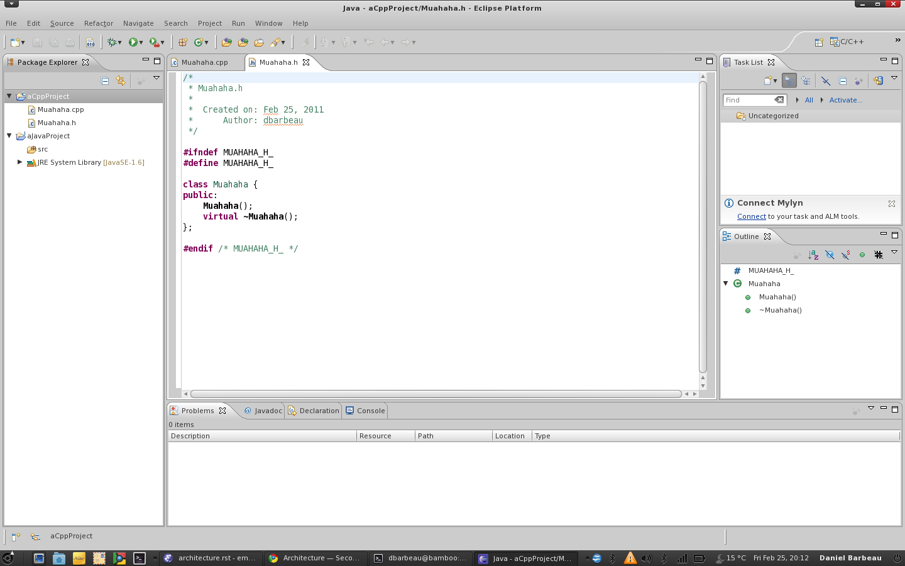
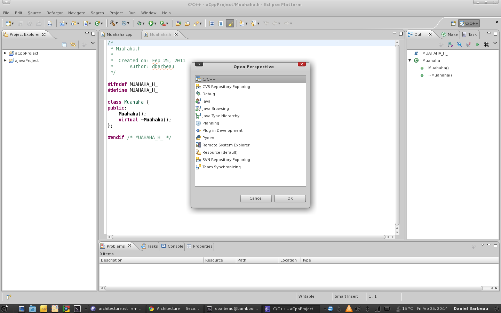
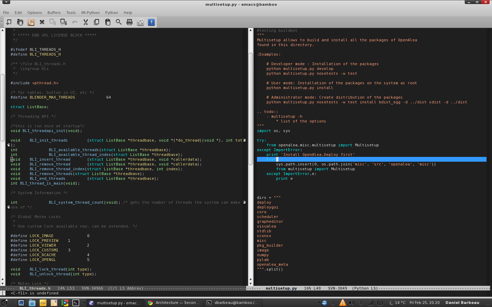
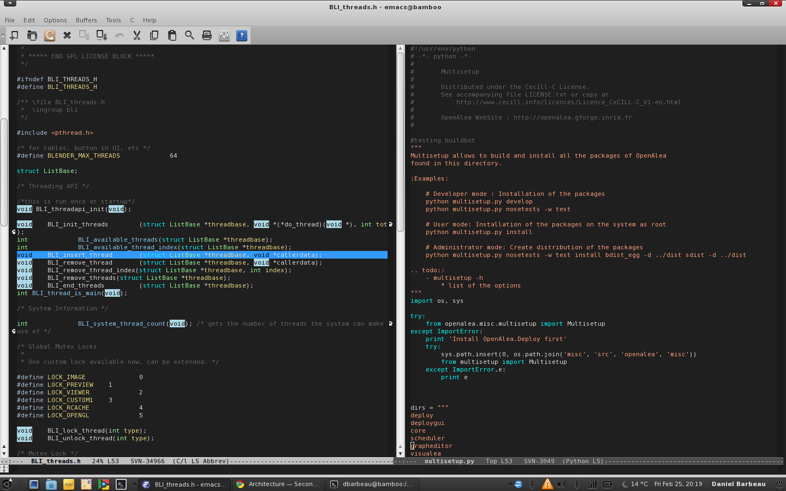
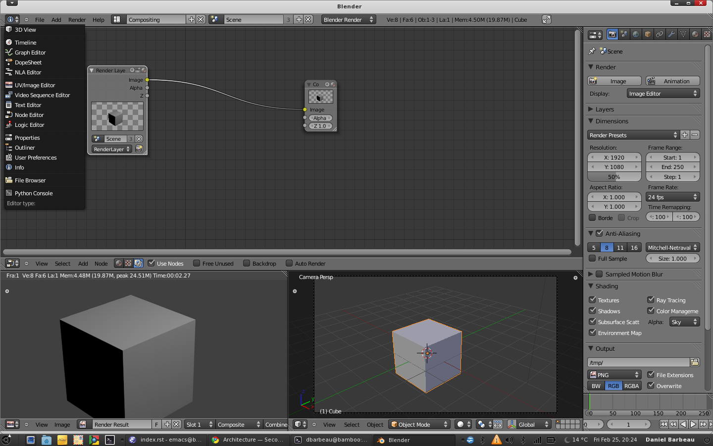

What others have done:
======================

I have investigated to identify applications that have adressed any of the
polymorphic, the extensible or the mutualisation issues or all of them!

Eclipse
-------
Eclipse is an IDE and a component platform based on Java. The user works in workspaces.
A workspace is a physical directory containing all the resources created by the user.
The type of resources is extensible. By default, Eclipse is used as a Java IDE. However
its component infrastructure (OSGi) has made it possible to add other faces to the IDE
like C++ development (Eclipse CDT), UML editing, Python development (Pydev), reporting (Birt),
distributed computing (INRIA-OASIS/ActiveEon ProActive), etc... New views can ba added by the
plugins.

A single workspace can contain many projects of different types. The UI has a "Project Explorer"
to the left that lists the projects contained in a workspace and manage each project's resources.

Depending on the type of project currently being worked on, the user can choose a "Perspective" (a
predefined partitionning of the UI area and an association of these areas to specified widgets) that
suites the task. There's a "Java" perspective, a "CDT perspective", a "Debugging" perspective.
The user can also customize the perspectives, add more perspectives, etc...

Key points
**********
Polymorphic, extensible, component based.

Architecture
~~~~~~~~~~~~
 * Language : Java
 * Component Model : Relies on the OSGi specifications for dynamically extensible applications.
 * User working model : One session views one workspace, each workspace can host different
   projects of different types. Each project can hold directories of resources.

User Interface
~~~~~~~~~~~~~~
 * Uses SWT.
 * Non-overlapping, pane based.
 * Widgets can be dragged and docked or tabbed (QMainWindow provides similar functionality)
 * Each widget has its own toolbar
 * The main menubar changes following the type of Project.

Emacs
-----
Text editor based on Lisp. But much more than a text editor : Email-client mode, calendar,
version control ...
Also an extensible text editor with "mode" (c-mode, c++-mode, python-mode, cmake-mode). Each mode
brings in syntax highlighting and specific menu for the buffer it's being used on.

The UI is organised in frames, and each frame can be split into an arbitrary number of windows.
Each window contains one document to edit and is set one mode.

Key points
**********
Polymorphic, extensible, component based.

Architecture
~~~~~~~~~~~~
 * Language : Lisp
 * Component Model : Emacs modes.
 * User working model : Files are loaded into buffers or new buffers are created.
   There can be no correlation between buffers. There is an optionnal "project" extension.

User Interface
~~~~~~~~~~~~~~
 * own text based engine / gtk
 * Non-overlapping, pane based.
 * one buffer per pane
 * buffer controls are in a mode-specific menu in the main menu bar.

Blender
-------
Blender is 3D content creation package including modelling, texturing, animating,
compositing, video editing, painting, etc...
It only edits "Blend" files, one at a time. It's basically a database of datablocks (objects),
and a dependency graph connecting these elements in different ways. Each datablock in the
blend file has a unique name id. Datablocks have datatypes - curves, surfaces, textures, materials,
meshes, objects, nodes, animation data, lights, scenes...

UI-wise, the main window is non-overlapping, subsplittable and the user can
place any widget in any pane. Each widget has it's own menu bar and toolbar.

Given the number of different tasks that can be accomplished inside blender, there are many
different editors (widgets). Blender supports task-oriented layouts that automatically split the working
area and place the editors in the desired place.

One blend file can link or append data from another blend file. The other file is referenced by it's
(relative|absolute) path. This makes sharing data between blend files easy! The difference between
the link and the append methods are that the linked object belongs the the external file, whereas the
appended object is copied (imported once and for all) into the current file.

Whatever object is being edited it is always part of the current
blend file, other editors are updated through dependency graph notifications.

Key points
**********
Polymorphic, extensible, vaguely component based, data-sharing

Architecture
~~~~~~~~~~~~
 * Language : C, python
 * Component Model : Blender RNA ?
 * User working model : User edits data inside a Blend file. Everything that
   is edited is potentially linked through the DAG and is part of the blend file
   or references an external datablock. (Linked objects are not editable).

User Interface
~~~~~~~~~~~~~~
 * own OpenGL ui
 * non-overlapping, pane based.
 * task based layouts, customizable.
 * one widget per pane with in-context menus.

Issues
~~~~~~
What happens if a referenced blend file moves? ==> link error. There is no
entity that references all blend files, tracks them and resolves links.

.. MedInria 2.0
.. ------------
.. MedInria is a Medical Imaging software developped by the Asclepios INRIA team.
.. Version 2.0 is a complete rewrite of the GUI, using Qt. It is based on the
.. Dream Toolkit (DTK) which features a component architecture relying on a set
.. of base interfaces to be implemented by plugin providers. A DTK plugin
.. can provide datatypes, process types and widget types. All these are referenced
.. by DTK and can be instanced on demand using a factory system.

.. In pratice the system is not so implementation-agnostic as it would like to be
.. and the base interfaces merely serve as handbags for the underlying datatypes.

.. However, MedInria builds upon this infrastructure. Regarding the UI, it is organised
.. into two spaces : the data explorer and the data viewer. The dataviewer is organised
.. into three horizontal areas: data browser, viewer, controls.

.. The viewer area can be subdivided in several predefined ways, or into a user-specified grid.
.. The controls area displays toolboxess that are task-oriented (segmentation, registration).
.. A combobox allows the user to select the task that he's about to perform and the
.. controls area (and maybe the viewer too?) gets updated with the according toolboxes.

.. Key points
.. **********
.. Polymorphic, extensible, component-based

.. Architecture
.. ~~~~~~~~~~~~
..  * Language : C++, QMetaObject
..  * Component Model : DTK/Qt
..  * User working model : import your data, view it, edit it, save it.

.. User Interface
.. ~~~~~~~~~~~~~~
..  * Qt
..  * non-overlapping, pane based.
..  * reserved spaces for task specific tools.

.. Issues
.. ~~~~~~
.. What happens if a a referenced blend file moves? ==> link error. There is no
.. entity that references all blend files, tracks them and resolves links.

Good Ideas
----------

UI Paradigm
***********
Regarding the polymorphic UI problem there is a constant solution
accross Eclipse, Emacs and Blender, where the UI is split in panes
with widgets inside each pane. Specific layouts can be created for
specific tasks.

.. MedInria has another approach where there is a reserved pane for
.. task-specific toolboxes. However, MedInria doesn't manipulate as many
.. different data types as Eclipse, Emacs, Blender or the VirtualPlants team
.. does.

Data sharing
************

Between components/editors
~~~~~~~~~~~~~~~~~~~~~~~~~~

In Eclipse and Emacs, as they are mainly text editors, the main data are text
files. However, in Eclipse, dependencies between resources of a workspace
can be created, eg: UML tools can reference files in the same workspace.

In Blender, all editable data belongs to the current blend file.

In all three, there is a top level container concept (session, project, workspace) that collects resources
and allows these to be linked to each other (although it is not very well defined in Emacs).
This top level concept is serializable.

.. As far as I know, MedInria doesn't use such a concept.

Between "top level containers"
~~~~~~~~~~~~~~~~~~~~~~~~~~~~~~

Eclipse allows to reference (import w/o copy) foreign projects.
Blender can reference any data contained in any blend file. However if the
path of the referred file changes, the link is broken.

.. Emacs and MedInria don't support this sort of functionnality, or at least,
.. it is not specified.

Extensability
*************
All four subjects rely on some sort of component
architecture, each more or less well defined/documented/specified.
A further inspection of each different component archs should be done.

What they don't have that we have
---------------------------------

A centralized resource system : Package Manager
