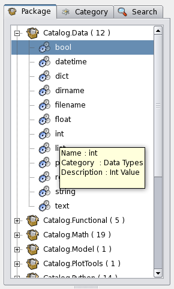

VisuAlea Manual
###############

Visualea is a high level visual programming GUI for OpenAlea

On Linux, in a shell, run the following command::

    $visualea

On Windows::

    Use start→ OpenAlea → Visualea
    Main Window

CHANGE THIS PICTURE
.. image:: ../_static/visualea.png
   :scale: 75
   :align: left

The main window is composed of :
    * The package manager (lists nodes),
    * The workspaces where one can graphically assemble dataflows,
    * Each node has it's own graphical interface,
    * The python interpreter for low level interaction (with code completion)
    * Python code editor

Package Manager
===============
The package manager finds the available components on the system.

It provides different tabs :

    * The package tab lists packages and nodes in their physical hierarchy.
    * The category tab sorts nodes into logical categories to ease-up lookup.
    * The search tab : search node by matching pattern with node name, category and description.

Package / Node / Dataflow
-------------------------

The package manager contains packages. A package is a distribution
unit containing a set of components ( node / graphs).
A package has several associated informations like :

    * Authors
    * Institutes
    * License
    * Description
    * URL

These package informations are accessible from the context menu:

    * Package Context Menu
      o Open Url : Open associated url
      o Infos : Display meta informations

Each package element has also a context menu :

    * Node (Component) Context Menu
      o Open : Open the node
      o Edit : Edit the node (Code Editor for Python node, Dataflow for Composite node)
      o Remove : Remove the node from the package

.. note:: Tooltip are available by moving the mouse pointer on an object.

.. note:: Double click on an object can either Open it or Edit it depending of its type.

User packages / system packages
===============================

Package Manager operations (menu)
=================================

    * → Load wralea_file : load a particular package description file
    * → Reload all packages : search all packages on the local system
    * → Find Nodes : Open the search tab
    * → Create
      o → Package : Create a new user package
      o → Python Node : Create a new component based on python code
      o → Composite Node : Create a new component based on other components (Macro node)

Workspaces
----------

User can create simple process by interconnecting boxes together. A box represent a function with inputs and outputs.

Opening workspaces
==================

You can create several workspaces :

    * Workspace → New empty workspace or CTRL + W
    * Double click on a graph in the package manager. In this case the workspace contains the graph.

Adding new nodes
================
* You can add nodes by doing a drag and drop between the package manager and the workspace.
* You also do Copy/Paste operation directly in the workspace.

A node is represented by a box with input and outputs ports.

* Inputs are on the top of the box
* Outputs are on the bottom of the box

You can view the documentation of a node by letting the mouse pointer on the node.

Connecting nodes
================

You can connect the nodes between them by doing a drag and drop operation between ports.

.. image:: ../_static/connection_nodes.png
   :width: 80%
   :height: 200px
   :scale: 100

* An output port can be connected to several different input ports : in this case the value will be copied to the different port
* An input port can be connected to several different output ports : in this cas the value will be the list of the different value of the connected output ports.

Node Graphical interface
========================

Each node has a configuration dialog (its widget). You can open the widget with the context menu (right click → open widget).

The widget depends of the node, it can be a simple value editor (spinbox for numbers, text editor…), or complex editor like 3D visualizer.

Running a dataflow
==================

The graph of nodes form an expression.

To evaluate the expression :

    * Menu → Workspace → Run will evaluate all the graph
    * Context Menu → Run on a particular node will evaluate only the selected node and its dependencies.

If you change a value of a node, the evaluation algorithm will compute only the changed nodes and their dependencies, avoiding to do several times the same computation.

.. deprecated::
    The node contained in a graph can be in different states/ The color of a node depends of its state:

    * Red : the node need to be reevaluated
    * Blue : the node doesn't need to be reevaluated

To change the status of a node or of a dataflow:

    * Context Menu → Reset: Reset the corresponding node
    * Workspace → Reset : Reset all the dataflow
    * Workspace → Invalidate : Force all nodes to be reevaluated the next time

You can visualize the value of a port : Context Menu → Print and with tooltips.

Save a dataflow / Composite Node
================================

A Composite node is an abstraction of a dataflow graph. It is a node which contains other nodes.

Composite nodes are used to :

    *  save a dataflow
    *  manage complexity

Saving a dataflow
-----------------

To save a dataflow :

    * Save the workspace as a composite node : Workspace → Save as composite node or CTRL + E

This function will save the graph but also the value of the node inputs

Managing complexity
-------------------

A composite node can be reused as a normal node (a simple box). You can embed a part of a graph in a composite node :

    * Select the node you want to group/embed
    * Workspace → Group or CTRL +G

This will create a new node containing all selected nodes.

This function can be used to improve the readability of your graph and facilitate reuse of complex functionalities.

I/O
---
As normal node, a composite node has inputs and outputs. They can be set :

    * Workspace → configure I/O

Each input has :

    * a name
    * an interface (used for the graphical interface and for type checking)
    * a default value

Each output has :

    * a name
    * an interface (used for type checking)

Open/Save a session
===================

You can save the entire session in order to keep all the data you currently use.

    * File → save session : Save the current session for a furur reuse
    * File → open session : Open a previously saved session
    * File → new session : reinitialize all the workspace

.. warning:: This functionality is not safe and we do NOT recommand to use it. Use export as composite node instead to save your work

Export Application
==================

A graph can be exported as a standalone application (a python module) : Workspace → Export to Application.

The application can be previewed with the command : Workspace → Preview Application.

Data Pool
---------

The data pool is a kind of data clipboard to store temporally computed data.

    * You can send data to the Pool : Port Context menu → Send to pool
    * You can re-use data of the pool in the dataflow by doing a drag and drop from the datapool list to aaninput port.
    * You can also access to the datapool in the interpreter (drag and drop to the interpreter will copy the correct code):

>>> datapool['name'] = object # set a data instance
>>> print datapool['name']    # get a data instance

Python Operations
-----------------

At any moment, you can use the python interpreter to launch python command or scripts.

CHANGE THIS PICTURE
.. image:: ../_static/ipython.png
   :width: 80%
   :height: 200px
   :scale: 100

The interpreter defines special variables :

    * session contains the different workspaces and the nodes they contain
    * datapool is the datapool dictionary
    * pmanager is the package manager

By doing a drag&drop of node with the mouse mid button, you will be able to access to the data of a node.

You can also do a drag and drop from the datapool.

Preferences
-----------

Interface preferences can be set via the preference dialog : Window → Preferences

Package manager
===============

This tab is used to set the directories to search for openalea packages.

.. warning::  section to be filled

Dataflow Python editor
======================

.. warning::  section to be filled

UI
==

.. warning::  section to be filled
